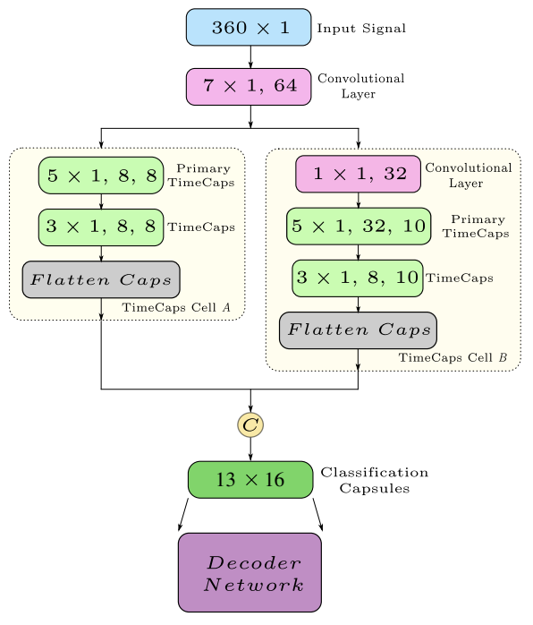

# Official Implementation for 'TimeCaps: Capturing Time Series Data With
Capsule Networks'

### [Paper](https://arxiv.org/abs/1911.11800) 
---
<p align="center">
  
</p>

[comment]: <>## Setup

[comment]: <>We provide an [`environment.yml`](environment.yml) file that can be used to create a Conda environment. 
[comment]: <>```bash
[comment]: <>conda env create -f environment.yml
[comment]: <>conda activate owczsl
[comment]: <>```

## Dataset
To download datasets,
```
sh download_data.sh
```

## Training
To run the model for MIT-States Dataset:
```
python train.py with cfg=config/mit-states.yml per_gpu_batchsize=32 num_freeze_layers=0 lr_transformer=3.5e-6 lr=3.6e-6 lr_cross=1e-6 k=3 offset_val=0.1 neta=0.01

```
## Evaluation

To evaluate the model for MIT-States Dataset:
```
python test.py  with cfg=config/mit-states.yml

```
